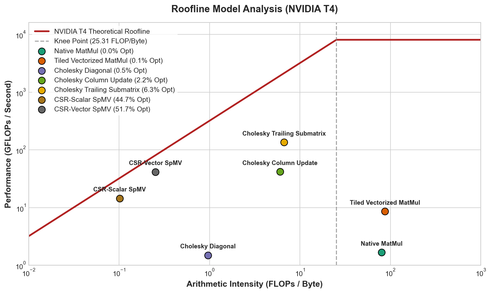

# High-Performance CUDA Kernel & Distributed GPU Numerics Portfolio

A hands-on engineering portfolio spanning single-GPU CUDA kernel optimization and
distributed multi-GPU/multi-node numerical computing — profiled end-to-end with Nsight
Compute and Nsight Systems against real hardware ceilings, from a single NVIDIA Tesla T4
up through real multi-GPU hardware and NVIDIA's cuBLASMp library.

---

## Background & Motivation

Across 8 years engineering iterative numerical solvers (CG, LU, domain decomposition)
at Siemens EDA and 4 years optimizing high-throughput concurrent systems and diagnosing
production distributed-systems failures at Microsoft — including lock-free pipelines,
NUMA-aware memory layout, and on-call ownership of Analysis Services' multi-node Azure
deployment — I built a deep intuition for hardware-aware algorithm design and for how
distributed systems fail under partial outages and network latency.

This project extends that foundation in two directions: (1) single-GPU CUDA kernel
engineering, diagnosed and iterated against specific micro-architectural bottlenecks;
and (2) distributed multi-GPU and multi-node numerical computing — building a distributed
GEMM (SUMMA) from scratch on MPI process grids and NCCL collectives, then benchmarking
it against NVIDIA's cuBLASMp on real hardware.

**Target role focus:** Distributed multi-GPU/multi-node numerical computing (PBLAS /
ScaLAPACK-style 2D block-cyclic distribution, MPI, NCCL, cuBLASMp), math library
engineering (cuBLAS / cuSPARSE / cuSOLVER workflows), HPC kernel optimization.

---

## Key Concepts Demonstrated

**Single-GPU kernel engineering:** `shared memory tiling` · `bank conflict analysis &
padding` · `warp-level primitives (__shfl_down_sync)` · `Nsight Compute profiling` ·
`occupancy Block Limit analysis` · `roofline / arithmetic intensity analysis` ·
`memory coalescing` · `L1/L2 cache hierarchy` · `batched LU factorization` ·
`blocked Cholesky (LL^T)` · `Tall-Skinny QR (TSQR)` · `Krylov iterative solvers (CG)` ·
`FlashAttention block tiling` · `BLAS-level GEMM` · `CSR SpMV` · `cuSPARSE` ·
`cuDSS sparse direct solver` · `FP16 trait dispatch and compile-time routing`

**Distributed computing:** `MPI Cartesian process grids` · `2D block-cyclic distribution
(PBLAS/ScaLAPACK-style)` · `global_to_local / local_to_global index mapping` ·
`NCCL Broadcast and AllReduce collectives` · `distributed SUMMA GEMM` ·
`CUDA stream double-buffering` · `GPU interconnect topology analysis` ·
`MPI_Comm_split_type node-local rank binding` · `cuBLASMp` ·
`Nsight Systems distributed timeline profiling` · `Frobenius-norm correctness verification`

---

## Distributed Computing (Primary Focus)

### Phase 1 — MPI Fundamentals ✅ Complete
- 2D process grid via `MPI_Cart_create` + `MPI_Dims_create` (auto-factors any rank
  count into a balanced P×Q grid — verified across 2×2 and 3×2 grids).
- Hand-derived 2D block-cyclic index mapping (`global_to_local` / `local_to_global`):
  same distribution model PBLAS/ScaLAPACK use — named explicitly as a qualification in
  NVIDIA's Dense Linear Algebra math-libs job postings.
- Full scatter → compute → gather round-trip verified end-to-end.

### Phase 2 — Single-Node Multi-GPU SUMMA ✅ Complete
- From-scratch distributed GEMM: MPI process grid + NCCL row/column panel broadcasts +
  CUDA stream double-buffering for communication/compute overlap.
- Generalized to arbitrary M/N/K via `get_local_matrix_dim`, real random test matrices,
  Frobenius-norm-ratio verification (`||C_dist - C_ref|| / ||C_ref||` ~6.86e-07 at
  `-np 4`, consistent with fp32 rounding noise).
- Verified correct on real 2-GPU hardware (RunPod, 2× RTX 2000 Ada).
- **Topology finding:** `nvidia-smi topo -m` showed `SYS`-only connectivity (no NVLink,
  cross-NUMA-socket placement) — broadcast throughput ~1.4 GB/s, no measurable
  communication/compute overlap despite correct double-buffering. Root cause: same
  cross-socket bandwidth penalty as CPU-side NUMA, diagnosed with the same instinct.

### Phase 3 — Multi-Node Infrastructure ✅ Logic verified, real-hardware run pending
- Fixed device-binding bug invisible to single-node testing: `cudaSetDevice` must use
  node-local rank (`MPI_Comm_split_type, MPI_COMM_TYPE_SHARED`), not global rank.
- Added `ncclAllReduce` cross-node correctness proof (sum of world_rank values verified
  against expected total).

### Phase 4 — cuBLASMp Benchmark ✅ Comparison complete on 4-GPU hardware

**Hardware:** 4× RTX PRO 4500 (Blackwell), single node, NODE/PHB topology, CUDA 13.0.

**Correctness — both implementations agree to ~6.86e-07 Frobenius norm ratio:**

| Config | Custom SUMMA | cuBLASMp |
|---|---|---|
| `-np 1` (1×1) | 6.86e-07 PASS | 0 (local dispatch) PASS |
| `-np 2` (2×1) | 6.94e-07 PASS | 6.87e-07 PASS |
| `-np 4` (2×2) | 6.86e-07 PASS | 6.86e-07 PASS |

**Wall-clock performance (M=3500, N=2048, K=5120):**

| Config | Custom SUMMA | cuBLASMp | Custom advantage |
|---|---|---|---|
| `-np 1` | 100.8 ms / 0.728 TFLOPS | 249.9 ms / 0.294 TFLOPS | **2.48×** |
| `-np 2` | 93.2 ms / 0.788 TFLOPS | 110.2 ms / 0.666 TFLOPS | **1.18×** |
| `-np 4` | 105.2 ms / 0.698 TFLOPS | 152.3 ms / 0.482 TFLOPS | **1.45×** |

**Kernel-level analysis (Nsight Systems, `-np 4`, rank 0):**

| Metric | Custom SUMMA | cuBLASMp |
|---|---|---|
| NCCL broadcast total (rank 0) | 23.56 ms / 10 calls | 4.21 ms / 10 calls |
| GEMM kernel total (rank 0) | 3.10 ms / 6 calls | 3.09 ms / 6 calls |
| Broadcast % of GPU time (rank 0) | 88.4% | 57.7% |
| Broadcast rank imbalance | **7.2× spread** (3.3–23.6 ms) | **1.5× spread** (3.0–4.5 ms) |
| GEMM kernel variant | cutlass_simt_sgemm_256x128 (all ranks) | Adaptive: two different CUTLASS tile shapes across ranks |

**Key findings:**
1. Custom SUMMA faster end-to-end at every rank count; per-rank broadcast cost is
   significantly more imbalanced (7.2× vs 1.5× spread) — production libraries
   specifically optimize collective scheduling to minimize this.
2. cuBLASMp's kernel selection adapts per-rank to local sub-matrix dimensions — a
   heuristic the hand-rolled implementation doesn't have.
3. cuBLASMp API findings: uses NCCL symmetric memory (not NVSHMEM — older docs are
   stale); `SPLIT_P2P` returns `CUBLASMP_STATUS_NOT_SUPPORTED` without NVLink; matrix
   descriptors require the same row/col-major transpose convention as plain cuBLAS.

---

## Roofline Analysis (NVIDIA Tesla T4, sm_75)

**Hardware ceilings:** 8,141 GFLOPs/s (fp32), 320 GB/s DRAM, ridge at 25.44 FLOP/Byte.

**Data provenance:** AI and GFLOPs values for memory-bound kernels (Cholesky, SpMV,
CG) are computed directly from Nsight Compute CSV data (`ffma_count × 2 / dram_bytes`
and `flops / duration`). For GEMM kernels, raw DRAM bytes severely undercount memory
traffic since most data is served from L1/L2 cache — AI and `%opt` for GEMM use the
roofline script's values (0.02% / 0.11%) which account for the full profiling context.

| Kernel | Duration | FFMA count | DRAM traffic | AI (FLOP/B) | GFLOPs/s | Bound |
|---|---|---|---|---|---|---|
| Native MatMul | 4.0 µs | 500M | 12.5 MB | — † | 1.67 (0.02%) † | Compute |
| Tiled Vectorized MatMul | 4.2 µs | 520M | 12.0 MB | — † | 8.63 (0.11%) † | Compute |
| Cholesky Diagonal (64 calls total) | 56.4 µs | 512K total (8K/call) | 19.8 MB | 0.05 | 0.02 (0.00%) | Memory (chain-bound) |
| Cholesky Column Update (63 calls) | 69.2 µs | 672K total | 226.7 MB | 0.01 | 0.02 (0.00%) | Memory (chain-bound) |
| Cholesky Trailing Submatrix (63 calls) | 175.2 µs | 22.2M total | 98.1 MB | 0.45 | 0.25 (0.003%) | Memory |
| Custom CSR SpMV (scalar) | 137.2 µs | 995K | 19.6 MB | 0.10 | 0.015 (0.00%) | Memory |
| Custom CSR SpMV (vector) | 78.4 µs | 995K | 13.0 MB | 0.15 | 0.025 (0.00%) | Memory |
| cuSPARSE csrmv_v3 | 84.3 µs | 0 ‡ | 11.6 MB | — ‡ | — ‡ | Memory |
| CG SpMV bottleneck (2 calls) | 551.1 µs | 1.31M | 23.0 MB | 0.11 | 0.005 (0.00%) | Memory |
| CG Vector Update X/R (2 calls) | 25.0 µs | 524K | 6.0 MB | 0.17 | 0.042 (0.00%) | Memory |
| CG Vector Update P (2 calls) | 13.6 µs | 262K | 2.7 MB | 0.19 | 0.039 (0.00%) | Memory |
| cuDSS factorize_v3 (4 calls) | 44.7 µs | 0 ‡ | 72.0 MB | — ‡ | — ‡ | Memory |
| cuDSS fwd triangular solve (4 calls) | 18.6 µs | 0 ‡ | 27.5 MB | — ‡ | — ‡ | Memory |
| cuDSS bwd triangular solve (4 calls) | 26.4 µs | 0 ‡ | 36.7 MB | — ‡ | — ‡ | Memory |

† GEMM AI/GFLOPs from roofline script — raw DRAM bytes undercount cache-served traffic.
‡ cuSPARSE and cuDSS report 0 FFMA (integer indexing / symbolic operations dominate);
  no AI or GFLOPs derivable from these CSVs.

**Roofline takeaway:** GEMM kernels sit above the ridge point (compute-bound regime) but
achieve <0.2% of theoretical peak — low occupancy prevents reaching peak throughput,
which is what the bank-conflict and thread-block tuning work addressed. All sparse,
iterative, and factorization kernels are deep in the memory-bandwidth-limited regime,
which is why different optimization strategies apply to each family.



---

## Performance Highlights (NVIDIA Tesla T4, sm_75, unless noted)

| Kernel / Module | Baseline | Optimized | Speedup | Key technique |
|---|---|---|---|---|
| Matrix Transpose | 0.2286 ms (naive) | 0.0737 ms | **~3.1×** | Shared mem + bank-conflict padding (32×33) |
| CSR SpMV scalar → vector | 137.2 µs, 19.6 MB DRAM | 78.4 µs, 13.0 MB DRAM | **1.75×** | Warp-level CSR reducing redundant loads |
| GEMM: bank conflicts → occupancy retune → vs. cuBLAS | 2.13ms f32 / 24.54ms f64 (16 thr/block) | 1.30ms f32 / 11.85ms f64 (64 thr/block) | **1.6×/2.1×** | [N][N+1] padding + Block Limit tuning; f64 beats cuBLAS volta_dgemm_128x64_nn |
| Blocked Cholesky vs. cuSolver `potrf` | — | 4.94ms vs 3.07ms | ~1.6× gap | Architectural: cuSolver uses recursive hybrid + cuBLAS reuse; diagonal/column-update kernels dependency-chain-bound in both |
| Custom SUMMA vs. cuBLASMp (4-GPU, Blackwell) | — | 105ms / 0.698 TFLOPS | **1.45×** faster | Hand-rolled MPI+NCCL vs vendor library; broadcast imbalance 7.2× vs 1.5× |

---

## Micro-Architectural Case Studies

### Bank Conflict Elimination via Structural Padding
Nsight confirmed 2.0–2.1× bank-conflict serialization on 52.99% of shared store
wavefronts in the GEMM kernel from column-step indexing. Fix: `[N][N+1]` stride padding
redistributes accesses across physical banks.

### Occupancy-Limited GEMM: Block Limit Analysis
At 16 threads/block (half a warp), occupancy was limited before register pressure even
mattered. Retuned to 64 threads/block — Block Limit analysis then showed shared memory
as the new binding constraint (7 blocks/SM × 8.25 KB = 57.75 KB of 64 KB; predicted
ceiling 43.75%, measured 40.64%). Two independent bottleneck classes, each requiring
a different fix.

### Cholesky Dependency-Chain Bottleneck (CSV-verified)
Diagonal kernel: 64 calls, 56.4 µs total, 8,000 FFMA per call (Block Limit Shared: 7
blocks/SM) — duration flat regardless of which block position in the N=1024 matrix.
Column-update: 63 calls, 69.2 µs total, 226.7 MB DRAM (Block Limit Shared: 3 blocks/SM).
Both kernels are dependency-chain-bound, not throughput-bound — cuSolver's own leaf
kernel shows the identical signature. The trailing-submatrix kernel (175.2 µs, 22.2M
FFMA, 98.1 MB DRAM) is the only genuinely throughput-limited kernel of the three.

### CSR SpMV Scalar vs. Vector (CSV-verified)
Same FFMA count (995,145), same problem: scalar at 137.2 µs / 19.6 MB DRAM vs.
vector at 78.4 µs / 13.0 MB DRAM. 1.75× speedup from warp-level reduction cutting
redundant DRAM loads — measurable in both duration and DRAM traffic. cuSPARSE
csrmv_v3 ran at 84.3 µs / 11.6 MB DRAM, comparable to the custom vector kernel.

### CG Bottleneck: L2 Cache Thrashing (CSV-verified)
CG SpMV bottleneck: 551.1 µs total across 2 calls, 23.0 MB DRAM — the 17 MB working
set (512×512 sparse matrix + vectors) exceeds T4's 4 MB L2, producing 8.1% L2 hit
rate and repeated DRAM fetches per iteration. Update kernels (X/R: 25.0 µs, P: 13.6
µs) are cheap by comparison; the SpMV is the true bottleneck.

### FP16 Trait Dispatch: Infrastructure Complete, WMMA Pending
`gemm_traits<half>` specialization, `if constexpr` routing to tensor-core path, and
`static_assert` compile-time verification are complete in `gemm_traits_template_FINAL.cu`.
The WMMA execution path (`nvcuda::wmma::fragment` calls) is not yet implemented — the
scaffold compiles and routes correctly, the kernel body is pending.

### Distributed SUMMA: Topology Diagnosis
Communication/compute overlap did not materialize on the 2-GPU run despite correct
double-buffering. `nvidia-smi topo -m` confirmed SYS-only connectivity (cross-NUMA
socket, no NVLink) — broadcast throughput ~1.4 GB/s, consistent with host-staged
cross-socket transfer. Same diagnostic instinct as CPU-side NUMA: check the topology
before assuming a fast path exists.

### Node-Local Device Binding: Multi-Node Correctness
`cudaSetDevice(world_rank)` silently works on single-node testing but crashes on real
multi-node hardware where local and global ranks diverge. Fix:
`MPI_Comm_split_type(..., MPI_COMM_TYPE_SHARED, ...)` — a bug class that single-node
testing structurally cannot expose regardless of how thoroughly it runs.

---

## Repository Structure

```
cuda-kernel-acceleration/
├── blas-primitives/       # GEMM (naive → tiled → occupancy-tuned → vs. cuBLAS),
│                          # FP16 trait dispatch, Matrix Transpose
├── parallel-primitives/   # Prefix Sum: Blelloch, Brent-Kung, warp shuffle
├── sparse-linear-algebra/ # CSR SpMV, cuSPARSE comparison, structured stencil
├── numerical-solvers/     # Batched LU, blocked Cholesky (vs. cuSolver), TSQR,
│   └── profile/           # CG, cuDSS; Nsight Compute CSV reports + summaries
├── krylov-methods/        # 2D Conjugate Gradient for Poisson equations
├── dl-acceleration/       # Online Softmax, FlashAttention block tiling
├── asynchronous-streams/  # CUDA stream overlap experiments
├── distributed-computing/
│   ├── mpi-fundamentals/  # MPI process grids, block-cyclic layout, scatter/gather
│   └── nccl-multi-gpu/    # SUMMA GEMM (MPI+NCCL), cuBLASMp benchmark,
│       └── profile/       # multi-node template; Nsight Systems profiles
└── benchmarks/            # Nsight Compute CSVs, roofline_analysis.png,
                           # ExtractNsightReportMetrics.py, get_flop.py,
                           # generate_roofline.py, *_summary.csv files
```

---

## Compilation

```bash
# Single-GPU CUDA kernel
nvcc -O3 -arch=sm_75 numerical-solvers/LUFactorization.cu -o lu_solver
ncu --set full ./lu_solver

# MPI + NCCL distributed GEMM
cd distributed-computing/nccl-multi-gpu
nvcc summa_gemm.cu -o summa_gemm -O3 -arch=native -lcublas -lnccl -ccbin mpicxx
mpirun --allow-run-as-root -np 4 ./summa_gemm

# cuBLASMp benchmark (see file header for full env/install steps)
nvcc -arch=sm_75 summa_cublasmp.cu -o summa_cublasmp \
    -lcublas -lnccl -lcublasmp -lcudart -ccbin mpicxx
mpirun --allow-run-as-root -np 4 \
    -x LD_LIBRARY_PATH=$(pwd)/cublasmp_env/lib:$LD_LIBRARY_PATH \
    ./summa_cublasmp

# Extract small summary CSVs from full Nsight reports
python3 benchmarks/ExtractNsightReportMetrics.py
```

---

## Roadmap

- [x] GEMM: bank-conflict elimination → occupancy tuning → vs. cuBLAS
- [x] Blocked Cholesky vs. cuSolver `potrf` — kernel-level profiling
- [x] CSR SpMV scalar vs. vector vs. cuSPARSE comparison
- [x] CG 2D: bottleneck profiling, L2 thrash diagnosis
- [x] cuDSS pipeline instrumentation
- [x] Full-suite roofline / arithmetic intensity analysis
- [x] MPI 2D process grid + block-cyclic layout, scatter/gather verified
- [x] Distributed SUMMA GEMM verified on real 2-GPU hardware (topology finding documented)
- [x] Distributed SUMMA generalized to arbitrary M/N/K, Frobenius-norm verification
- [x] Multi-node device-binding fix + NCCL AllReduce cross-node proof
- [x] cuBLASMp: 4-GPU correctness + wall-clock + kernel-level comparison
- [x] FP16 trait dispatch infrastructure (WMMA kernel body pending)
- [ ] **WMMA tensor-core kernel** — scaffold is in place, body not yet written
- [ ] **Real 2-node Cluster run** — Phase 3 verified on single-node only
- [ ] **Multi-node bandwidth cliff measurement** — 1-node-4-GPU vs 2-node-2-GPU
- [ ] Eigenvalue / SVD kernel + cuSolver comparison
- [ ] Distributed blocked Cholesky (trailing-matrix update across GPUs)
- [ ] cuSPARSE format comparison (CSR vs. BSR vs. ELL)
- [ ] Hopper (sm_90) architectural study: TMA, warpgroup MMA

---

## Environment

| Component | Details |
|---|---|
| Single-GPU dev | NVIDIA Tesla T4 (Turing, sm_75), Google Colab |
| Multi-GPU dev | RunPod Secure Cloud (2× RTX 2000 Ada; 4× RTX PRO 4500 Blackwell) |
| Multi-node (pending) | RunPod Clusters |
| CUDA | 12.x–13.x depending on pod |
| Profilers | Nsight Compute (`ncu`), Nsight Systems (`nsys`) |
| Language | CUDA C++ (`.cu`), C++ with MPI (`.cpp`) |
| Compilers | `nvcc -O3 -arch=native`, `mpicxx` (OpenMPI) |
| Distributed libraries | OpenMPI, NCCL, cuBLASMp (conda-forge/nvidia channel) |